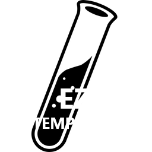

<p align="center"></p>

<h1 align="center"> 💎Easy Jekyll💎 </h1>

<p align="center">  </p>

> Easy Template in Jekyll to help you knows more about Jekyll testing, changing and more

**ATENTION: The Github version its not updated!**

# 🗿 How use?

> Starting with Jekyll! Learning all that Jekyll offers with an easy and smart template to get you started!
> REMEBER: you need install the ruby and git installed!

1. Cloning the Repository

```cmd
$ git clone https://github.com/RamiresOliv/Easy_Jekyll.git
```

2. After Use the git clone you can use `cd` to open the project

```cmd
$ cd Easy_Jekyll
```

3. Now use these commands in order for start a server

```cmd
$ gem install Jekyll
```

```cmd
$ cd ./bin/server
```

5. Checking if the server started in `localhost:4000` on your browser

6. Now be free to change any code and read :)

# 📜 License

> The GNU GPL is the most widely used free software license and has a strong copyleft requirement. When distributing derived works, the source code of the work must be made available under the same license. There are multiple variants of the GNU GPL, each with different requirements.

**LICENSE: [GNU General Public License v2.0](LICENSE)**
<br><br>

- Permissions
  - Commercial use
  - Modification
  - Distribution
  - Private use
- Limitations
  - Liability
  - Warranty
- Conditions
  - License and copyright notice
  - State changes
  - Disclose source
  - Same license

# 🎯 What you can do

> ✔ to you can<br>❌ to you can't

- ✔ You can change codes.
- ✔ learn and much more as the code is open to anyone and also easy to use just use jekyll and that's it! oh and it's also free ;).
- ✔ Can use exemples from this Template in others project.
- ✔ Give Credits; _the project its **free**... So its good you **give the credits** for more people use ;)_
- ❌ Can sell this Template.

# 💻 Server

Local Host: **localhost:4000** _(default)_

`port`: You can change in the `bin/server` the `port` exemple for `4034`, `5225` and Others<br>
`baseurl`: You can change the `baseurl` but its not great.

# 📣 Github Markdown

**Hey!** take it easy the project doesn't work if you open the MDs on github it's NECESSARY to run the code on Jekyll so that it is converted and usable.

# 🛠 Others

Creator: _[RamiresOliv](https://github.com/RamiresOliv)_
<br>&<br>
Translater: _[Jekyll](https://jekyllrb.com) <3_
<br>&<br>Host: _[Github](https://github.com) <3_

<p align="center">   </p>

<h1 align="center"> 💎Easy Jekyll💎 </h1>

<p align="center"></p>
