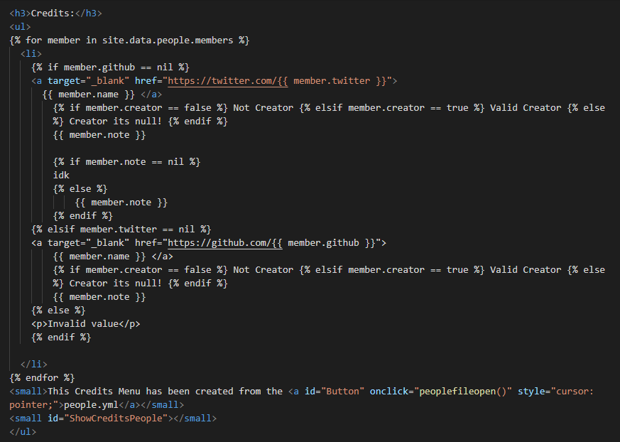

<i>{{ site.description }}</i>

 

<h1>Hello World!</h1>

  

<h3>Peoples:</h3>
<ul>

  <li>
    
<a target="_blank" href="https://twitter.com/{{ member.twitter }}">
      {{ member.name }} </a>
         Not Creator  Creator 

        
            {{ member.note }}
        
    

<a target="_blank" href="https://github.com/{{ member.github }}">
        {{ member.name }} </a>
         Not Creator  Creator 

        
            {{ member.note }}
        
    

Invalid value

    

  </li>

<small>see the tutorial on how to use <a id="Button" onclick="peoplefileopen()" style="cursor: pointer;">yml and jekyll</a></small>
<small id="ShowCreditsPeople"></small>
</ul>

  

<b>About from the Template</b>

- Thanks for using the {{ site.title }} <a href="https://github.com/RamiresOliv/Easy_Jekyll">see here</a>
- Okay Start using the <a href="Docs">Docs</a>

<b>Not sure how to get started after starting the server?</b>

<li>See this <a href="Docs/After">document</a> it can help you</li>

 

